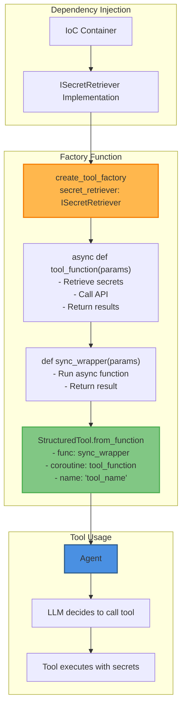

# OpsResolve - Production Incident Analysis System

## Overview

**OpsResolve** is an **AI-powered incident analysis system** that automatically investigates production issues by orchestrating multiple specialized agents to gather evidence from different monitoring systems and produce comprehensive root cause analysis reports.

## What It Does

When you give OpsResolve an incident ID (like `INC0000123`), it:

1. **Gathers incident details** from ServiceNow (ticket system)
2. **Searches logs** in Splunk (log aggregation)
3. **Analyzes metrics & traces** from Azure Application Insights or DataDog (APM/monitoring)
4. **Correlates findings** across all data sources
5. **Identifies root cause** with evidence-backed reasoning
6. **Classifies the incident** into categories (Software/Hardware/Data/User Understanding)
7. **Provides actionable resolution steps** and prevention recommendations

## Architecture

### High-Level System Architecture

```mermaid
graph TB
    User[👤 User/Incident] --> Supervisor[🎯 OpsResolve Supervisor<br/>LangGraph Orchestrator]
    
    Supervisor --> ServiceNow[📋 ServiceNow Agent]
    Supervisor --> AppInsights[📊 App Insights Agent]
    Supervisor --> DataDog[🔍 DataDog Agent]
    Supervisor --> Splunk[📝 Splunk Agent]
    
    ServiceNow --> SNTools[ServiceNow Tools]
    AppInsights --> AITools[App Insights Tools]
    DataDog --> DDTools[DataDog Tools]
    Splunk --> SplunkTools[Splunk Tools]
    
    SNTools --> SNAPI[ServiceNow API]
    AITools --> AzureAPI[Azure Monitor API]
    DDTools --> DDAPI[DataDog API]
    SplunkTools --> SplunkAPI[Splunk API]
    
    Supervisor --> Report[📄 Incident Analysis Report<br/>- Classification<br/>- Root Cause<br/>- Resolution Steps]
    
    style Supervisor fill:#4A90E2,stroke:#2E5C8A,stroke-width:3px,color:#fff
    style ServiceNow fill:#81C784,stroke:#4CAF50,stroke-width:2px
    style AppInsights fill:#81C784,stroke:#4CAF50,stroke-width:2px
    style DataDog fill:#81C784,stroke:#4CAF50,stroke-width:2px
    style Splunk fill:#81C784,stroke:#4CAF50,stroke-width:2px
    style Report fill:#FFB74D,stroke:#F57C00,stroke-width:2px
```



### Component Hierarchy

```mermaid
graph TD
    Root[🏗️ OpsResolve System]
    
    Root --> Supervisor[Supervisor Layer]
    Root --> Agents[Agent Layer]
    Root --> Tools[Tool Layer]
    Root --> Infra[Infrastructure Layer]
    Root --> IoC[IoC Layer]
    
    Supervisor --> SupervisorImpl[ops_resolve_supervisor.py<br/>OpsResolveSupervisor]
    
    Agents --> SNA[servicenow/servicenow_agent.py<br/>ServiceNowAgent]
    Agents --> AIA[app_insights/app_insights_agent.py<br/>AppInsightsAgent]
    Agents --> DDA[datadog/datadog_agent.py<br/>DataDogAgent]
    Agents --> SPA[splunk/splunk_agent.py<br/>SplunkAgent]
    
    Tools --> SNT[servicenow_tools.py<br/>- create_get_incident_tool<br/>- create_update_incident_tool]
    Tools --> AIT[app_insights_tools.py<br/>- create_get_operation_id_tool<br/>- create_get_logs_tool]
    Tools --> DDT[datadog_tools.py<br/>- create_service_dependencies_tool<br/>- create_find_errors_tool]
    Tools --> SPT[splunk_tools.py<br/>- create_search_logs_tool<br/>- create_get_results_tool]
    
    Infra --> Secrets[secrets/<br/>ISecretRetriever]
    Infra --> ConfigMaps[configmaps/<br/>IConfigMapRetriever]
    Infra --> Auth[authenticators/<br/>HcpAuthenticator]
    Infra --> LLM[llm/<br/>AzureChatOpenAILlmCreator]
    
    Secrets --> EnvSecrets[EnvVariableSecretRetriever]
    Secrets --> VolumeSecrets[VolumeMountSecretRetriever]
    
    ConfigMaps --> EnvConfig[EnvVariablesConfigMapRetriever]
    ConfigMaps --> VolumeConfig[VolumeMountConfigMapRetriever]
    
    IoC --> CompRoot[ops_resolve_composition_root.py<br/>OpsResolveCompositionRoot]
    IoC --> IoCConfig[ops_resolve_ioc_config.py<br/>OpsResolveIocConfig]
    
    style Root fill:#4A90E2,stroke:#2E5C8A,stroke-width:3px,color:#fff
    style Supervisor fill:#81C784,stroke:#4CAF50,stroke-width:2px
    style Agents fill:#81C784,stroke:#4CAF50,stroke-width:2px
    style Tools fill:#FFB74D,stroke:#F57C00,stroke-width:2px
    style Infra fill:#BA68C8,stroke:#8E24AA,stroke-width:2px
    style IoC fill:#64B5F6,stroke:#1976D2,stroke-width:2px
```



### Dependency Injection Flow

```mermaid
graph LR
    subgraph "IoC Container"
        Config[🔧 OpsResolveIocConfig<br/>DEPLOYMENT_FLAVOR]
        CompRoot[📦 CompositionRoot]
    end
    
    subgraph "Infrastructure Selection"
        Config -->|DEVELOPMENTLOCAL| EnvSecrets[Environment Variables]
        Config -->|K8DEPLOYED| VolumeSecrets[Volume Mounts]
        Config -->|GITWORKFLOWDEPLOYED| VolumeSecrets2[Volume Mounts]
    end
    
    subgraph "Dependency Tree"
        CompRoot --> SecretRetriever[ISecretRetriever]
        CompRoot --> ConfigRetriever[IConfigMapRetriever]
        CompRoot --> EnvReader[IAzureLlmConfigReader]
        
        SecretRetriever --> Auth[HcpAuthenticator]
        ConfigRetriever --> Auth
        
        Auth --> LLMCreator[ILlmCreator]
        EnvReader --> LLMCreator
        
        LLMCreator --> LLM[Azure OpenAI LLM]
        
        SecretRetriever --> ToolFactories[Tool Factories]
        ToolFactories --> AgentTools[Agent Tools]
        
        LLM --> AgentInit[Agent Initialization]
        AgentTools --> AgentInit
        
        AgentInit --> SupervisorInit[Supervisor Initialization]
    end
    
    style Config fill:#FFB74D,stroke:#F57C00,stroke-width:2px
    style CompRoot fill:#4A90E2,stroke:#2E5C8A,stroke-width:2px
    style LLM fill:#81C784,stroke:#4CAF50,stroke-width:2px
    style SupervisorInit fill:#BA68C8,stroke:#8E24AA,stroke-width:2px
```



### Execution Flow (Incident Analysis)

```mermaid
sequenceDiagram
    participant U as 👤 User
    participant S as 🎯 Supervisor
    participant SN as 📋 ServiceNow Agent
    participant DD as 🔍 DataDog Agent
    participant AI as 📊 App Insights Agent
    participant SP as 📝 Splunk Agent
    
    U->>S: "Analyze incident INC0000123"
    
    Note over S: LangGraph decides<br/>which agents to call
    
    S->>SN: Get incident details
    SN->>S: Incident data + timeline
    
    par Parallel Data Gathering
        S->>DD: Find service dependencies
        DD->>S: Service map + dependencies
        S->>DD: Find service errors and traces
        DD->>S: Error traces + spans
    and
        S->>AI: Get operation ID for failed URL
        AI->>S: Operation ID
        S->>AI: Get logs for operation ID
        AI->>S: Exception logs + traces
    and
        S->>SP: Search logs for incident timeframe
        SP->>S: Relevant log entries
    end
    
    Note over S: Correlate findings<br/>across all sources
    
    S->>S: Analyze patterns<br/>Identify root cause<br/>Classify incident
    
    S->>SN: Update incident with findings
    SN->>S: Confirmation
    
    S->>U: 📄 Comprehensive Analysis Report<br/>- Classification<br/>- Root Cause<br/>- Evidence<br/>- Resolution Steps<br/>- Prevention Measures
```



### Tool Factory Pattern



## How It Works

### 1. Supervisor Pattern

The supervisor uses **LangGraph** to create an intelligent orchestrator that:
- Dynamically decides which agents to call based on the incident context
- Coordinates information gathering across multiple systems in parallel or sequence
- Synthesizes findings into coherent analysis
- Maintains conversation state and history

### 2. Agent-Based Architecture

Each agent specializes in one monitoring system and follows the `IAgent` interface:

- **ServiceNowAgent**: 
  - Retrieves incident tickets and metadata
  - Updates incidents with findings
  - Searches for similar historical incidents
  
- **AppInsightsAgent**: 
  - Analyzes Azure telemetry (errors, traces, metrics)
  - Retrieves operation IDs for failed requests
  - Correlates logs across different telemetry types

- **DataDogAgent**: 
  - Monitors service health and dependencies
  - Identifies which downstream services are causing errors
  - Retrieves APM traces and spans

- **SplunkAgent**: 
  - Searches application and system logs
  - Manages long-running search jobs
  - Retrieves and formats search results

### 3. Tool Factory Pattern

Tools are created using factory functions with dependency injection:

```python
# Before (tightly coupled to environment variables)
@tool
def get_incident(incident_id: str):
    api_key = os.getenv("SERVICENOW_API_KEY")
    ...

# After (dependency injection with interfaces)
def create_get_incident_tool(secret_retriever: ISecretRetriever):
    async def get_incident(incident_id: str):
        api_key = await secret_retriever.retrieve_mandatory_secret_value("SERVICENOW_API_KEY")
        ...
    return StructuredTool.from_function(...)
```

**Benefits**:
- Easy to test with mock implementations
- Environment-agnostic (works in local dev, K8s, CI/CD)
- Type-safe with interface contracts
- Async-first design for non-blocking I/O

### 4. Dependency Injection (IoC Container)

Uses `dependency-injector` library for environment-based configuration:

```python
# Automatically selects implementation based on DEPLOYMENT_FLAVOR
_secrets_retriever = providers.Selector(
    _config.DeploymentFlavor,
    DEVELOPMENTLOCAL=EnvironmentVariableSecretRetriever,  # .env files
    K8DEPLOYED=VolumeMountSecretRetriever,                # K8s secrets
    GITWORKFLOWDEPLOYED=VolumeMountSecretRetriever,       # GitHub Actions
)
```

**Deployment Flavors**:
- `DEVELOPMENTLOCAL`: Development machine with `.env` files
- `K8DEPLOYED`: Kubernetes cluster with volume-mounted secrets
- `GITWORKFLOWDEPLOYED`: GitHub Actions with mounted secrets

## Incident Classification Framework

The supervisor classifies incidents into 4 main categories with specific subcategories:

### SOFTWARE INCIDENTS
- Software bugs and errors
- Application downtime
- Performance degradation
- Configuration errors
- Service availability problems

### HARDWARE INCIDENTS
- Hardware failures (servers, drives, switches)
- Network outages
- Resource exhaustion (CPU, memory, disk)
- Physical theft or loss

### DATA INCIDENTS
- Data breaches and leaks
- Data corruption
- Data loss
- Data processing errors

### USER UNDERSTANDING INCIDENTS
- Human error
- Lack of training and awareness
- User interface confusion
- Social engineering and phishing
- Insider threats

## Output Report Structure

Every incident analysis follows this structured format:

```
INCIDENT ANALYSIS REPORT

├── Executive Summary
│   └── Brief overview of the incident and its impact
│
├── Incident Classification
│   ├── Category: [SOFTWARE/HARDWARE/DATA/USER UNDERSTANDING]
│   ├── Subcategory: [specific type from framework]
│   └── Reasoning: Evidence-based justification
│
├── Timeline Analysis
│   └── Chronological view of events across all data sources
│
├── Root Cause Analysis
│   └── Evidence-backed determination of what caused the incident
│
├── Impact Assessment
│   └── Business and technical impact analysis
│
├── Evidence Summary
│   └── Key findings from logs, metrics, traces, and ServiceNow data
│
├── Resolution Steps
│   └── Immediate actions taken and recommended next steps
│
├── Prevention Measures
│   └── Long-term recommendations to prevent recurrence
│
└── Lessons Learned
    └── Process improvements and knowledge capture opportunities
```

## Usage

### Streamlit Web UI (Recommended)

```bash
# Set up environment
export PYTHONPATH=$(pwd)
export DEPLOYMENT_FLAVOR=DEVELOPMENTLOCAL

# Run Streamlit app with authentication
streamlit run use_cases/ops_resolve/streamlit_app.py
```

Features:
- Interactive web interface
- Azure AD authentication
- Real-time streaming of agent actions
- Formatted markdown output
- Phoenix tracing integration

### Command Line

```bash
# Basic usage
python use_cases/ops_resolve/test_servicenow_datadog.py INC0000123

# With streaming output
python use_cases/ops_resolve/test_servicenow_datadog.py INC0000123 --stream
```

### Programmatic Usage

```python
import asyncio
from use_cases.ops_resolve.ioc.ops_resolve_composition_root import OpsResolveCompositionRoot

async def analyze_incident():
    # Initialize IoC container
    container = OpsResolveCompositionRoot()
    
    # Get supervisor from container (handles all dependencies)
    supervisor = await container.get_supervisor()
    
    # Run analysis
    result = await supervisor.run("Analyze incident INC0000123")
    
    return result

# Execute
result = asyncio.run(analyze_incident())
```

## Key Technologies

| Technology | Purpose |
|------------|---------|
| **LangGraph** | Workflow orchestration and supervisor state management |
| **LangChain** | LLM integration, tool calling, and message handling |
| **Phoenix** | Observability and tracing for debugging AI decisions |
| **dependency-injector** | IoC container for dependency management |
| **Streamlit** | Web UI for interactive analysis |
| **Azure OpenAI** | Large language model for reasoning and analysis |
| **asyncio** | Asynchronous I/O for non-blocking API calls |

## Design Patterns

### 1. Supervisor Pattern
Central coordinator delegates tasks to specialized agents based on context and current state.

### 2. Factory Pattern
Tools and agents are created via factory functions that inject dependencies at creation time.

### 3. Dependency Injection
Interfaces (`ISecretRetriever`, `IConfigMapRetriever`, `IAgent`) allow environment-specific implementations without code changes.

### 4. Strategy Pattern
Different agents implement the same `IAgent` interface, making them interchangeable.

### 5. Async/Await Pattern
Non-blocking operations for all API calls, enabling efficient parallel execution.

### 6. Closure Pattern
Factory functions close over injected dependencies, making them available to tools at runtime without global state.

## Key Benefits

✅ **Automated Investigation**: Reduces mean time to resolution (MTTR) by automatically gathering evidence

✅ **Evidence-Based**: All conclusions backed by actual data from monitoring systems

✅ **Comprehensive**: Checks multiple data sources automatically in parallel

✅ **Structured Output**: Consistent reporting format for all incidents

✅ **Extensible**: Easy to add new agents/tools for other monitoring systems

✅ **Observable**: Phoenix tracing for debugging the AI decision-making process

✅ **Environment-Agnostic**: Works seamlessly across local dev, K8s, and CI/CD

✅ **Testable**: Dependency injection makes unit testing straightforward

✅ **Type-Safe**: Strong typing with interfaces and protocols

## Configuration

### Required Environment Variables

```bash
# Deployment Configuration
DEPLOYMENT_FLAVOR=DEVELOPMENTLOCAL  # or K8DEPLOYED, GITWORKFLOWDEPLOYED

# Azure OpenAI (via HCP)
HCP_CLIENT_ID=<your-client-id>
HCP_CLIENT_SECRET=<your-client-secret>
HCP_TENANT_ID=<your-tenant-id>
HCP_AUTHORITY_URL=<authority-url>
HCP_TOKEN_ENDPOINT=<token-endpoint>

# ServiceNow
SERVICENOW_BASE_URL=<your-instance>.service-now.com
SERVICENOW_USERNAME=<username>
SERVICENOW_PASSWORD=<password>

# Azure Application Insights
AZURE_TENANT_ID=<tenant-id>
AZURE_CLIENT_ID=<client-id>
AZURE_CLIENT_SECRET=<client-secret>
AZURE_APP_RESOURCE=<resource-id>

# DataDog
DATADOG_API_KEY=<api-key>
DATADOG_APP_KEY=<app-key>
DATADOG_API_URL=https://api.datadoghq.com

# Splunk
SPLUNK_HOST=<splunk-host>
SPLUNK_PORT=8089
SPLUNK_USERNAME=<username>
SPLUNK_PASSWORD=<password>

# Phoenix Tracing (optional)
PHOENIX_COLLECTOR_ENDPOINT=http://localhost:6006
```

### IoC Configuration

The system automatically selects implementations based on `DEPLOYMENT_FLAVOR`:

| Component | DEVELOPMENTLOCAL | K8DEPLOYED | GITWORKFLOWDEPLOYED |
|-----------|------------------|------------|---------------------|
| Secrets | Environment Variables | Volume Mounts | Volume Mounts |
| ConfigMaps | Environment Variables | Volume Mounts | Volume Mounts |
| Authentication | HCP (cached) | HCP (cached) | HCP (cached) |

## Extending the System

### Adding a New Agent

1. **Create the agent class**:
```python
class NewMonitoringAgent(IAgent):
    def __init__(self, tools, llm, secret_retriever):
        super().__init__(tools, llm)
        self.secret_retriever = secret_retriever
```

2. **Create tool factories**:
```python
def create_new_monitoring_tool(secret_retriever: ISecretRetriever):
    async def new_monitoring_action(param: str):
        api_key = await secret_retriever.retrieve_mandatory_secret_value("NEW_MONITORING_API_KEY")
        # ... implementation
    return StructuredTool.from_function(...)
```

3. **Register in IoC container**:
```python
@staticmethod
async def _create_new_monitoring_agent(llm_creator, secret_retriever):
    llm = await OpsResolveCompositionRoot._create_llm_async(llm_creator)
    tools = [create_new_monitoring_tool(secret_retriever)]
    return NewMonitoringAgent(tools, llm, secret_retriever)
```

4. **Add to supervisor**:
```python
async def get_supervisor(self):
    agents = [
        await self._create_servicenow_agent(...),
        await self._create_new_monitoring_agent(...),  # Add here
    ]
    return OpsResolveSupervisor(llm, agents)
```

### Adding a New Tool to Existing Agent

1. **Create factory function** in appropriate `*_tools.py`:
```python
def create_my_new_tool(secret_retriever: ISecretRetriever):
    async def my_new_tool(param: str) -> Dict[str, Any]:
        """Tool description for LLM."""
        # Implementation
    
    def sync_wrapper(param: str):
        return _run_async(my_new_tool(param))
    
    return StructuredTool.from_function(
        func=sync_wrapper,
        coroutine=my_new_tool,
        name="my_new_tool"
    )
```

2. **Add to agent initialization**:
```python
tools = [
    existing_tool,
    create_my_new_tool(secret_retriever),  # Add here
]
```

## Troubleshooting

### Phoenix Tracing Not Working

```bash
# Ensure Phoenix is running
docker run -p 6006:6006 -p 4317:4317 arizephoenix/phoenix:latest

# Or install and run locally
pip install arize-phoenix
python -m phoenix.server.main serve
```

### Agent Not Responding

Check Phoenix traces at `http://localhost:6006` to see:
- Which tools were called
- What parameters were passed
- What responses were received
- Any errors or exceptions

### Authentication Failures

Verify credentials are correct:
```python
# Test secret retrieval
from fx_ai_reusables.secrets.concretes.env_variable.environment_variable_secret_retriever import EnvironmentVariableSecretRetriever

retriever = EnvironmentVariableSecretRetriever()
value = await retriever.retrieve_mandatory_secret_value("YOUR_SECRET_NAME")
print(f"Retrieved: {value[:10]}...")  # Print first 10 chars
```

### LLM Not Making Decisions

Increase LLM temperature or adjust system prompt in `system_prompt.py`:
```python
# In composition root or test file
llm = await llm_creator.create_llm(temperature=0.7)  # Default is usually 0
```

## Performance Considerations

- **Parallel Agent Execution**: LangGraph can call multiple agents in parallel when dependencies allow
- **Caching**: HCP authentication tokens are cached to reduce API calls
- **Streaming**: Results stream back as they're generated for better UX
- **Async I/O**: All API calls are non-blocking for efficient resource usage

## Security

- **No Secrets in Code**: All credentials retrieved via interfaces
- **Environment Isolation**: Different implementations for dev/prod
- **Least Privilege**: Each agent only has access to its own tool secrets
- **Audit Trail**: Phoenix tracing provides complete audit log
- **Azure AD Integration**: Streamlit UI uses Azure AD for authentication

## Future Enhancements

- [ ] Add PagerDuty agent for on-call management
- [ ] Implement automated remediation actions
- [ ] Add machine learning for incident prediction
- [ ] Create knowledge base from past incidents
- [ ] Implement multi-tenancy for different teams
- [ ] Add Slack/Teams integration for notifications
- [ ] Build dashboard for incident trends and metrics

## Contributing

When adding new agents or tools, ensure:
1. Follow the factory pattern with dependency injection
2. Use `ISecretRetriever` and `IConfigMapRetriever` interfaces
3. Provide comprehensive docstrings for LLM understanding
4. Add async/await support for all I/O operations
5. Include error handling and meaningful error messages
6. Add Phoenix tracing spans for observability
7. Update this documentation with your changes

## Conclusion

OpsResolve represents an **AI Site Reliability Engineer (SRE)** that performs the tedious investigation work, allowing human engineers to focus on actual fixes rather than data gathering and correlation. By leveraging modern AI capabilities and solid software engineering practices, it provides a scalable, maintainable, and extensible platform for incident analysis.
